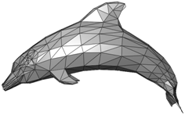
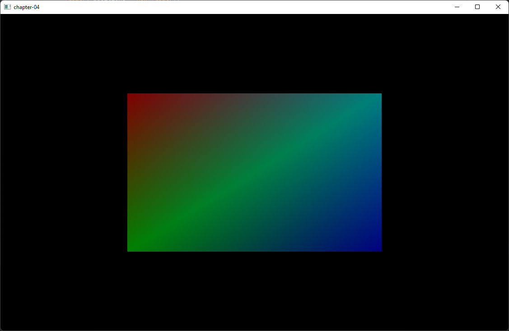

# Chapter 04 - More on render

In this chapter we will continue talking about how OpenGL renders things. We will draw a quad instead of a triangle and set additional data to the Mesh, such as a color for each vertex.

You can find the complete source code for this chapter [here](https://github.com/lwjglgamedev/lwjglbook/chapter-04).

# Mesh modification

As we said at the beginning, we want to draw a quad. A quad can be constructed by using two triangles as shown in the next figure.


As you can see each of the two triangles is composed of three vertices. The first one formed by the vertices V1, V2 and V4 \(the orange one\) and the second one formed by the vertices V4, V2 and V3 \(the green one\). Vertices are specified in a counter-clockwise order, so the float array to be passed will be \[V1, V2, V4, V4, V2, V3\]. Thus, the data for that shape could be:

```java
float[] positions = new float[] {
    -0.5f,  0.5f, 0.0f,
    -0.5f, -0.5f, 0.0f,
     0.5f,  0.5f, 0.0f,
     0.5f,  0.5f, 0.0f,
    -0.5f, -0.5f, 0.0f,
     0.5f, -0.5f, 0.0f,
}
```

The code above still presents some issues. We are repeating coordinates to represent the quad. We are passing twice V2 and V4 coordinates. With this small shape it may not seem a big deal, but imagine a much more complex 3D model. We would be repeating the coordinates many times, like in the figure below \(where a vertex can be shared between six triangles\).



At the end we would need much more memory because of that duplicate information. But the major problem is not this, the biggest problem is that we will be repeating processes in our shaders for the shame vertex. This is where Index Buffers come to the rescue. For drawing the quad we only need to specify each vertex once this way: V1, V2, V3, V4\). Each vertex has a position in the array. V1 has position 0, V2 has position 1, etc:

| V1 | V2 | V3 | V4 |
| --- | --- | --- | --- |
| 0 | 1 | 2 | 3 |

Then we specify the order in which those vertices should be drawn by referring to their position:

| 0 | 1 | 3 | 3 | 1 | 2 |
| --- | --- | --- | --- | --- | --- |
| V1 | V2 | V4 | V4 | V2 | V3 |

So we need to modify our `Mesh` class to accept another parameter, an array of indices, and now the number of vertices to draw will be the length of that indices array. Keep in mind also that now we are just using three floats for representing the position of a vertex, but we want to associate the color of each one. Therefore, wee need to modify the `Mesh` class like this.

```java
public class Mesh {
    ...
    public Mesh(float[] positions, float[] colors, int[] indices) {
        try (MemoryStack stack = MemoryStack.stackPush()) {
            numVertices = indices.length;
            ...
            // Color VBO
            vboId = glGenBuffers();
            vboIdList.add(vboId);
            FloatBuffer colorsBuffer = stack.callocFloat(colors.length);
            colorsBuffer.put(0, colors);
            glBindBuffer(GL_ARRAY_BUFFER, vboId);
            glBufferData(GL_ARRAY_BUFFER, colorsBuffer, GL_STATIC_DRAW);
            glEnableVertexAttribArray(1);
            glVertexAttribPointer(1, 3, GL_FLOAT, false, 0, 0);

            // Index VBO
            vboId = glGenBuffers();
            vboIdList.add(vboId);
            IntBuffer indicesBuffer = stack.callocInt(indices.length);
            indicesBuffer.put(0, indices);
            glBindBuffer(GL_ELEMENT_ARRAY_BUFFER, vboId);
            glBufferData(GL_ELEMENT_ARRAY_BUFFER, indicesBuffer, GL_STATIC_DRAW);

            glBindBuffer(GL_ARRAY_BUFFER, 0);
            glBindVertexArray(0);
        } 
    }
    ...
}           
```

After we have created the VBO that stores the positions, we need to create another VBO which will hold the color data. After that we create another one for the indices. The process of creating that VBO is similar but the previous ones but notice that the type is now `GL_ELEMENT_ARRAY_BUFFER`. Since we are dealing with integers we need to create an `IntBuffer` instead of a `FloatBuffer`. The VAO will contain now three VBOs, one for positions, the other one for colors and another one that will hold the indices and that will be used for rendering.

After that, we need to change the drawing call in the `SceneRender` class to use indices:
```java
public class SceneRender {
    ...
    public void render(Scene scene) {
        ...
        scene.getMeshMap().values().forEach(mesh -> {
                    glBindVertexArray(mesh.getVaoId());
                    glDrawElements(GL_TRIANGLES, mesh.getNumVertices(), GL_UNSIGNED_INT, 0);
                }
        );
        ...
    }
    ...
}
```

The parameters of the `glDrawElements` method are:

* mode: Specifies the primitives for rendering, triangles in this case. No changes here.
* count: Specifies the number of elements to be rendered.
* type: Specifies the type of value in the indices data. In this case we are using integers.
* indices: Specifies the offset to apply to the indices data to start rendering.

Now we can just create a new Mesh with the extra vertex parameters (colors) and the indices in the `Main` class:
```java
public class Main implements IAppLogic {
    ...
    public static void main(String[] args) {
        ...
        Engine gameEng = new Engine("chapter-04", new Window.WindowOptions(), main);
        ...
    }
    ...
    public void init(Window window, Scene scene, Render render) {
        float[] positions = new float[]{
                -0.5f, 0.5f, 0.0f,
                -0.5f, -0.5f, 0.0f,
                0.5f, -0.5f, 0.0f,
                0.5f, 0.5f, 0.0f,
        };
        float[] colors = new float[]{
                0.5f, 0.0f, 0.0f,
                0.0f, 0.5f, 0.0f,
                0.0f, 0.0f, 0.5f,
                0.0f, 0.5f, 0.5f,
        };
        int[] indices = new int[]{
                0, 1, 3, 3, 1, 2,
        };
        Mesh mesh = new Mesh(positions, colors, indices);
        scene.addMesh("quad", mesh);
    }
    ...
}
```

Now we need to modify the shaders, not because of the indices, but to use the color per vertex. The vertex shader (`scene.vert`) is like this:
```glsl
#version 330

layout (location=0) in vec3 position;
layout (location=1) in vec3 color;

out vec3 outColor;

void main()
{
    gl_Position = vec4(position, 1.0);
    outColor = color;
}
```

In the input parameters, you can see we receive a new `vec2` for the color and we just return that to be used the fragment shader (`scene.frag`) which is like this:
```glsl
#version 330

in  vec3 outColor;
out vec4 fragColor;

void main()
{
    fragColor = vec4(outColor, 1.0);
}
```

We just use the input color parameter to return the fragment color. It is important to notice, that the color value will be interpolated when using in the fragment shader, so the result will be something like this.



[Next chapter](../chapter-05/chapter-05.md)